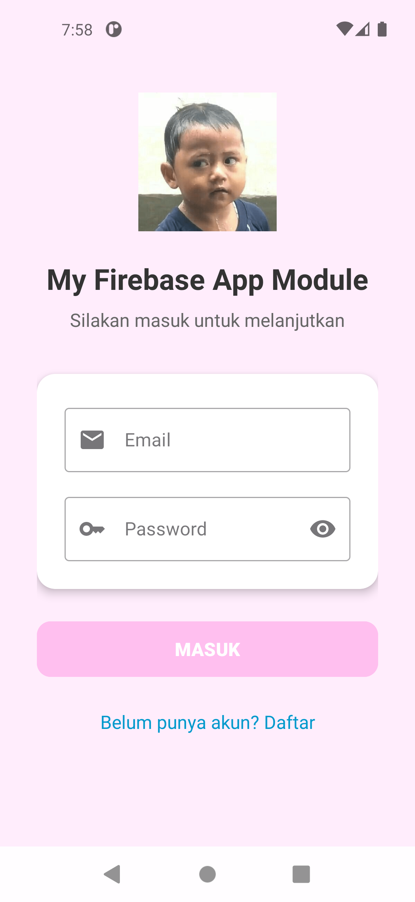
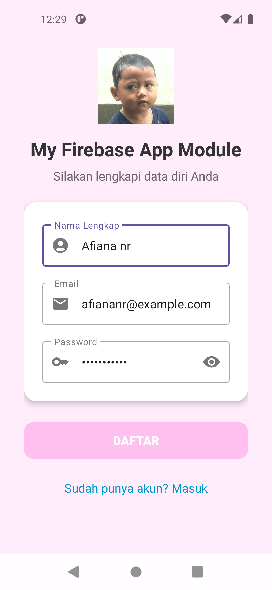
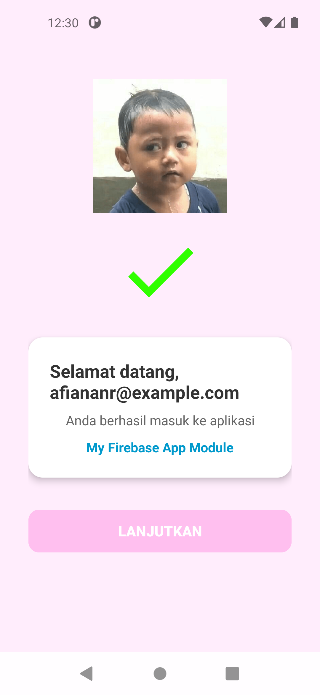

# 📱 MyFirebase App – Firebase Android Integration

Project ini adalah aplikasi Android sederhana yang terintegrasi dengan **Firebase**, dikembangkan menggunakan **Kotlin**. Aplikasi ini mendemonstrasikan proses **registrasi dan login pengguna** menggunakan **Firebase Authentication** dan menyimpan data ke **Firebase Realtime Database**.

- Autentikasi pengguna dengan Email & Password
- Penyimpanan data pengguna ke Realtime Database
- Navigasi antara halaman Login, Register, dan Home
- Desain UI menggunakan Material Design Components

> Project ini dibuat untuk keperluan tugas **mata kuliah Pemrograman Mobile** pada **minggu ke-13**. Tujuan dari pembuatan aplikasi ini adalah untuk memahami dan mempraktikkan integrasi layanan **Firebase** pada aplikasi Android.

## 🛠️ Teknologi yang Digunakan

- Kotlin
- Android Studio
- Firebase (Authentication, Realtime Database)
- ViewBinding
- ConstraintLayout
- Material Components

## 📸 Screenshots

Tampilan antarmuka aplikasi:

### 🖼️ Login Screen

### 🖼️ Register Screen

### 🖼️ Home Screen

